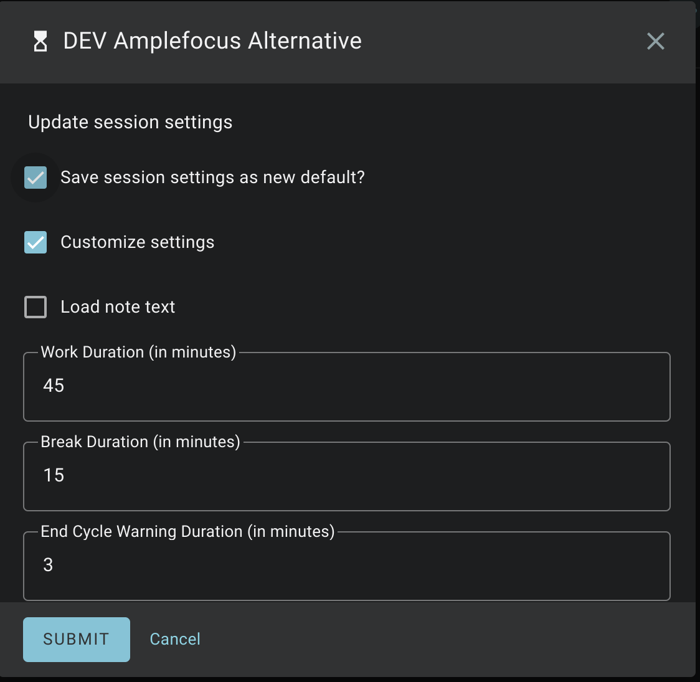
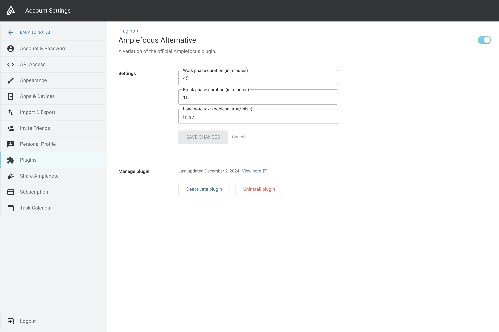

# Amplefocus *Alternative*
tl dr; Download the plugin [here](https://public.amplenote.com/GY8AybxPdegbe3i3Gmx3kJHF)

This is an [Amplenote plugin](https://www.amplenote.com/help/developing_amplenote_plugins) that
gives an alternative setup to the official [Amplefocus plugin](https://public.amplenote.com/XqCZ5b6qfsXQPRM8ZJRo8CrF).

## Changes from the original plugin
### December 2024
- Added `{Edit Settings}` insert text to modify plugin options directly from Amplenote 
  - This will update the settings on the app's Plugin settings screen
- Custom work time, break time, and warning time can be set prior to starting a session
  - Need to set `customizeSettingBySession` to `true`, otherwise defaults are used
- Warning bell goes off a set number of minutes before the end of the work phase

### November 2024
- Use `{Focus}` instead of `{Start Focus}` to start a session
- Default start time is within the next `5` minutes
- Default number of sessions is `1` session
- Logging is stored under the tag `plugins/amplefocus-alt`
- Added `loadNoteText` option for Amplefocus questions
  - Note logging is set to `false` by default

